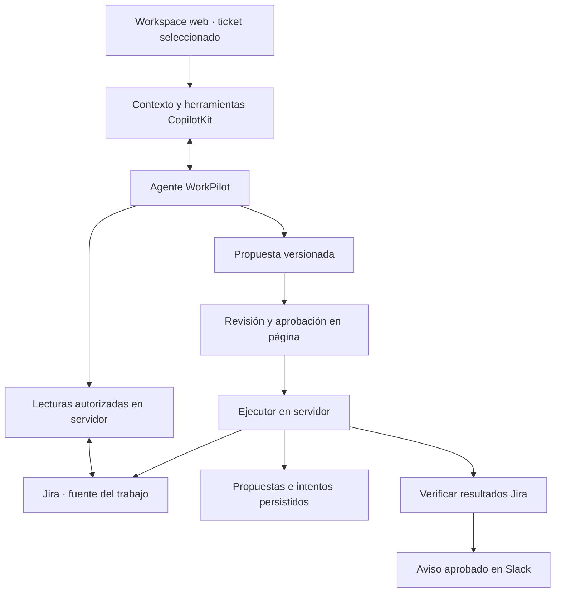

# WorkPilot — PRD del MVP

Versión 0.1 · 12 de septiembre de 2026 · Equipo de 4 personas

Estado: propuesta de trabajo lista para iniciar. Las decisiones de alcance de este documento son propuestas explícitas; no se presentan como acuerdos previos del equipo. Jira y avisos por Slack sí fueron indicados por el equipo. No se ha implementado ni probado el producto.

## 1. Producto y objetivo

**WorkPilot es un agente integrado en un workspace web que entiende el ticket de Jira que el usuario está viendo, investiga qué impide avanzar y prepara el trabajo para el siguiente responsable. Con aprobación humana, actualiza Jira y comunica el resultado por Slack.**

Usuario inicial: líder técnico de un equipo de desarrollo que debe preparar el traspaso de un ticket bloqueado a un compañero o a QA.

Problema: el estado formal del ticket no siempre refleja las decisiones de los comentarios, las dependencias y lo que ya se intentó. Preparar el traspaso exige releer, decidir qué falta, crear seguimiento y avisar al equipo.

Resultado esperado: un ticket con próximos pasos concretos y trazables, un seguimiento creado cuando corresponde y un aviso verificable en Slack. El agente debe evitar repetir trabajo que ya consta en Jira y reconocer cuándo no hay evidencia suficiente.

## 2. Relación con las conversaciones y el hackathon

Se conserva la idea original: contexto del lugar → agente → herramientas → propuesta → aprobación → acción → resultado persistente. Se mantiene Web como superficie principal y el equipo de cuatro personas.

Las conversaciones propusieron incidentes como ejemplo. Adoptamos para v0.1 una interacción propia: **traspaso de tickets bloqueados entre desarrollo y QA**, con datos y decisiones en Jira y comunicación posterior por Slack. Esto concreta usuario, problema, dataset e interacción propios, siguiendo la orientación del starter de reemplazar su escenario de muestra. No se promete diagnóstico automático de producción.

El starter es la fuente técnica y de orientación del evento. Las reglas actuales de la sede tienen precedencia; sede y plazo aún no están confirmados. Las conversaciones son antecedentes de producto, no prueba de capacidades del código ni reglas oficiales.

Fuentes y correcciones: [revisión del starter](STARTER-REVIEW.md). Documentación reproducida: [índice de referencia](reference/starter-kit/README.md).

## 3. Qué demuestra el agente

1. **Contexto ambiental:** «esto» identifica el ticket visible sin que el usuario escriba su clave o copie sus comentarios.
2. **Investigación mediante herramientas:** consulta comentarios y dependencias relevantes, en lugar de responder sólo con la descripción inicial.
3. **Decisión contextual:** distingue hechos, hipótesis y faltantes; selecciona las acciones necesarias. No crea siempre la misma subtarea.
4. **Acción controlada:** genera una propuesta estructurada; el servidor ejecuta únicamente su versión aprobada.
5. **Continuidad del trabajo:** después de refrescar, relee Jira y el registro de ejecución para responder «¿qué falta?».

La persistencia del trabajo no implica conservar todo el historial de conversación. El historial durable del chat queda fuera del MVP.

## 4. Decisiones de alcance para empezar

| Tema | Decisión v0.1 | Estado |
|---|---|---|
| Integraciones | Jira para trabajo; Slack para avisos | Indicado por el equipo |
| Superficie | Adaptar `apps/web`; abrir allí un ticket de Jira | Propuesta basada en las conversaciones |
| Caso de uso | Preparar el traspaso de un ticket bloqueado | Propuesta para diferenciar el proyecto |
| Instalación | Un proyecto Jira Cloud y un canal Slack de prueba | Supuesto operativo por verificar |
| Agente | Conservar la fábrica y el proveedor del starter; prompt propio para WorkPilot | Decisión técnica propuesta |
| CopilotKit | Conservar contexto, herramientas y UI del starter | Decisión técnica propuesta |
| Persistencia | Jira conserva trabajo; almacenamiento de servidor conserva propuestas e intentos | Adaptación a construir |
| Slack | Un aviso saliente al terminar el plan; sin agente conversacional en Slack | Alcance propuesto |
| Ejecución inicial | Demo local, un proceso de servidor y disco persistente | Alcance propuesto |
| Idioma | Interfaz y demo en español; nombres técnicos consistentes | Supuesto ajustable |

## 5. Flujo principal

1. El usuario abre un ticket en WorkPilot. Ve título, estado, responsable, prioridad, comentarios y dependencias disponibles.
2. Escribe: **«Revisá esto y dejalo listo para el equipo.»**
3. El agente identifica el ticket seleccionado, consulta sus comentarios y relaciones y explica el bloqueo con referencias a la evidencia.
4. Presenta una tarjeta de propuesta: hallazgos, datos faltantes, cambios antes/después, subtarea sugerida, comentario y texto exacto del aviso de Slack.
5. El usuario puede aprobar o rechazar. Para cambiar el plan, pide una revisión que genera una nueva versión pendiente.
6. Al aprobar, el servidor verifica sesión, versión, destino y estado actual de Jira. Ejecuta las acciones aprobadas y registra cada resultado.
7. Sólo cuando las acciones de Jira están verificadas, envía el aviso aprobado a Slack. Devuelve claves e identificadores reales; no fabrica enlaces.
8. El usuario refresca y pregunta **«¿qué falta?»**. El agente responde con el estado actual, incluyendo cualquier acción o aviso pendiente.

## 6. Requisitos funcionales y aceptación

| ID | Requisito | Criterio de aceptación |
|---|---|---|
| F01 | Contexto del ticket visible | Cambiar entre dos tickets y usar el mismo prompt produce referencias y propuestas para el ticket correcto. |
| F02 | Lecturas de Jira | Obtiene descripción, comentarios, relaciones y campos relevantes desde el proyecto configurado; errores de permisos son visibles. |
| F03 | Evidencia trazable | Cada conclusión relevante referencia la clave del ticket o el identificador de comentario consultado. Distingue hipótesis de hechos. |
| F04 | Detectar información faltante | Si falta responsable o criterio de aceptación, lo señala. Si no puede elegir responsable con evidencia, deja la asignación pendiente. |
| F05 | Propuesta estructurada | La UI muestra destino, campos anteriores/nuevos, subtarea, comentario y texto/canal de Slack antes de aprobar. |
| F06 | Aprobación en servidor | El chat no tiene herramientas de escritura directa. Rechazar produce cero cambios en Jira y cero avisos. |
| F07 | Escrituras Jira | Puede asignar responsable permitido, actualizar prioridad válida, crear hasta una subtarea y agregar un comentario, sólo si están incluidos en el plan aprobado. |
| F08 | Aviso Slack | Tras verificar Jira, envía una vez el texto aprobado al canal configurado y registra el resultado del proveedor. |
| F09 | Persistencia y lectura posterior | Refresh y reinicio del servidor conservan registro de ejecución; Jira devuelve las mismas claves creadas. |
| F10 | Evitar duplicados | Doble clic o repetición de aprobación no crea otra subtarea, comentario ni aviso. Un resultado incierto exige reconciliación. |
| F11 | Cambios concurrentes | Si los campos relevantes o comentarios cambiaron desde la propuesta, se invalida y se pide una nueva revisión; no se sobreescribe silenciosamente. |
| F12 | Fallo parcial | Si Jira se actualiza y Slack falla, informa «Jira actualizado; aviso pendiente». Reintentar el aviso no repite Jira. |
| F13 | Próximos pasos | «¿Qué falta?» considera las subtareas y decisiones existentes y no presenta como resuelto el trabajo que sólo fue preparado. |

Las escrituras a varios sistemas no son una transacción atómica. Un fallo parcial debe conservar lo que ya ocurrió y mostrarlo con precisión.

## 7. Fuera del MVP

- Extensión de navegador o aplicación embebida en Jira.
- Bot que recibe órdenes, lee conversaciones o pide aprobación en Slack.
- Vigilancia automática, webhooks, recordatorios recurrentes o monitoreo permanente.
- Ejecución de despliegues, rollbacks, cierre automático de tickets o resolución de incidentes.
- Logs de producción, métricas o historial de despliegues no presentes en Jira.
- OAuth para múltiples organizaciones, administración de usuarios o permisos multiempresa.
- Mobile, voz, búsqueda web, chat durable y configuración de todos los patrocinadores.
- Copia completa de Jira, tableros complejos o edición masiva de tickets.

## 8. Demo propia y evidencia

Dataset sintético dentro de servicios reales de prueba. Las claves siguientes son ilustrativas, no registros existentes.

**Ticket A: `WP-42`, «Validación de checkout bloqueada».** Descripción ambigua; comentario reciente indica que el arreglo ya está desplegado en staging; dependencia `WP-39` sigue sin resolver; falta documentar el caso de prueba. Existe una subtarea de implementación que el agente no debe duplicar.

**Ticket B: `WP-57`, «Revisión de accesibilidad lista para QA».** Dependencias cerradas y responsable definido; falta únicamente preparar el resumen del traspaso. El mismo prompt debe producir un plan distinto y omitir acciones innecesarias.

Propuesta esperada en A: explicar el bloqueo con evidencia; conservar el estado abierto; proponer una subtarea específica para completar la validación si no existe; comentar el plan; asignar sólo cuando haya un responsable válido y justificado; preparar el aviso a Slack.

Video de referencia: **dos minutos**, según el starter; comprobar límite vigente en la sede.

| Tiempo | Evidencia visible |
|---|---|
| 0:00–0:15 | Usuario, problema, ticket y comentarios antes del prompt. |
| 0:15–0:40 | «Revisá esto» sin clave; herramientas consultan evidencia y explican qué falta. |
| 0:40–1:00 | Propuesta concreta y aprobación. |
| 1:00–1:25 | Resultado real en Jira y aviso real en Slack. |
| 1:25–1:45 | Refresh y «¿qué falta?» con estado actualizado. |
| 1:45–2:00 | Rechazo sin efectos o recuperación de aviso fallido; aporte original y tecnologías usadas. |

## 9. Arquitectura mínima propuesta

- Reutilizar Next.js, CopilotKit React, endpoint de agente y fábrica `makeAgent` del starter.
- Usar el proveedor de modelo ya soportado, configurado en servidor y validado con la cuenta del equipo. No fijar una disponibilidad de modelo no comprobada.
- Sustituir el destino Ambiguous del flujo de ejemplo por un adaptador Jira, conservando el patrón de aprobación. Esto es trabajo nuevo, no una capacidad existente de Jira en el starter.
- Slack saliente mediante adaptador de servidor; propuesta inicial: Slack Web API con bot y canal fijo. Validar autenticación y permisos en la primera prueba. No requiere iniciar `apps/channel` para el alcance propuesto.
- Conservar la separación de la fábrica de agente por ejecución y la exclusión de herramientas de escritura del runtime web.
- Para demo local, extender el patrón de metadatos en disco del starter. Jira sigue siendo la fuente de los registros del trabajo. No usar sólo memoria o `localStorage` para controlar intentos.
- Un despliegue público necesita autenticación, política de origen y almacenamiento durable apropiados. No es condición para empezar la demo local.

### Contratos a acordar en el primer bloque

Definiciones iniciales del proyecto; no representan APIs ya existentes del starter ni nombres de endpoints de proveedores.

| Entidad | Campos mínimos |
|---|---|
| `WorkContext` | `issueKey`, `summary`, `status`, `priority`, `assignee`, `comments`, `relatedIssues`, `existingSubtasks`, `snapshotVersion`, `fetchedAt` |
| `Evidence` | `sourceType`, `issueKey`, `commentId?`, `excerpt`, `url?` verificada |
| `ActionPlan` | `planId`, `version`, `issueKey`, `snapshotVersion`, `findings`, `missingInfo`, `actions`, `slackDraft`, `expiresAt` |
| `Action` | `actionId`, `type`, `before`, `after`, `evidenceRefs`, `status`, `providerResult?` |
| `Execution` | `executionId`, `planId`, `approvedVersion`, `status`, `actionResults`, `slackStatus`, `createdAt` |

Tipos de acción permitidos: `assign_issue`, `set_priority`, `create_subtask`, `add_comment`. Las herramientas del agente consultan datos y proponen el plan; aprobar y ejecutar son acciones de la página hacia el servidor.

Estados de ejecución: `pending_approval`, `declined`, `expired`, `executing`, `succeeded`, `partial`, `failed`, `uncertain`. Registrar errores por acción, sin ocultarlos bajo un éxito general.

### Límites de ejecución

- Servidor valida que ticket, usuario asignable, prioridad y canal pertenezcan a los destinos configurados.
- Aprobar vincula una sesión a campos inmutables de una versión del plan. Si cambia la propuesta, requiere nueva aprobación.
- Claves de operación persistidas evitan repetir efectos; no asumir que Jira o Slack resuelven idempotencia automáticamente.
- Un timeout posterior al envío no prueba fracaso. Reconciliar por identificadores o marcadores de operación; si no es concluyente, mantener `uncertain` y no reenviar automáticamente.
- Comentarios de Jira son datos no confiables: no pueden cambiar permisos, destinatarios ni instrucciones del agente.

## 10. Validación y definición de terminado

El MVP está terminado cuando F01–F13 tienen evidencia, los dos tickets producen planes distintos, Jira y Slack funcionan realmente y el flujo de rechazo no tiene efectos.

Verificación del starter: `npm run verify` y `npm run build --workspace web`; `verify` no sustituye pruebas con servicios reales. Añadir pruebas relevantes del gate de aprobación, rechazo, plan obsoleto, doble aprobación y fallo parcial; probar en vivo lectura/escritura/read-back de Jira y envío de Slack.

Preparar README ejecutable desde un clon limpio, variables documentadas sin secretos, atribución al starter, registro de lo heredado y lo construido durante el evento, video, descripción y borrador del post. La sede y el equipo deben confirmar reglas y declaraciones factuales antes de la entrega.

## 11. Organización y dependencias

El backlog y los límites de archivos están en [TASKS.md](TASKS.md). Trabajar en un único flujo integrado desde el primer bloque; cada persona tiene una entrega funcional y una dependencia explícita.

| Persona | Área principal | Primera entrega |
|---|---|---|
| P1 | Agente, contexto y decisiones | Respuesta contextual y plan estructurado con evidencia. |
| P2 | Workspace, revisión y resultados | Ticket visible y tarjeta de propuesta/estado con adaptadores de prueba. |
| P3 | Jira, ejecución y persistencia | Lectura real y una escritura aprobada con read-back. |
| P4 | Slack, integración, QA y demo | Adaptador de aviso y primer recorrido integrado verificable. |

## 12. Datos operativos pendientes

No reabrir el concepto para comenzar. Completar durante el bloque inicial:

| Dato | Responsable | Cuándo bloquea |
|---|---|---|
| Nombres y disponibilidad de las cuatro personas | Equipo | Reparto definitivo y estimación del tiempo. |
| Sede, portal, hora límite y zona horaria | P4 + equipo | Calendario final y entrega; no bloquea el diseño. |
| Jira Cloud o variante, URL, proyecto, tipo de issue, subtareas, campos y usuarios válidos | P3 | Primera integración real y alcance de escrituras. |
| Workspace, canal y permisos de Slack | P4 | Primer envío real. |
| Cuenta y modelo disponibles | P1 | Primera ejecución del agente. |
| Destino del repositorio del equipo y quién integra | P4 + equipo | Colaboración y entrega; este documento es local. |

Mientras se gestionan accesos, P1/P2 pueden trabajar con fixtures que respeten el contrato. Los fixtures no cuentan como integración real completada.

## 13. Riesgos y recortes

1. **Accesos tardíos:** probar Jira y Slack en el primer bloque. Si faltan, declarar el bloqueo; no sustituir la evidencia real por una simulación sin indicarlo.
2. **Alcance excesivo:** si falta tiempo, reducir escrituras a una subtarea y un comentario; conservar contexto, aprobación, Jira real, Slack real y refresh.
3. **Ejemplo demasiado parecido al starter:** mostrar el traspaso, las dependencias, la prevención de trabajo duplicado y los dos planes distintos como aporte propio.
4. **Error parcial:** persistir resultados por operación y reintentar sólo pasos cuyo fallo sea conocido; demostrarlo antes de grabar.
5. **Falta de tiempo para el video:** reservar el último bloque para verificación y entrega; no agregar superficies extra.
